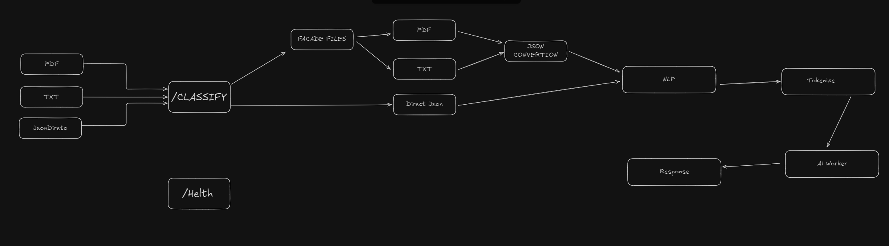
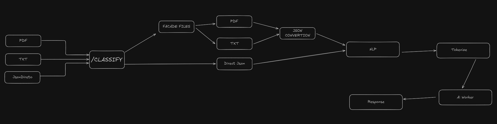
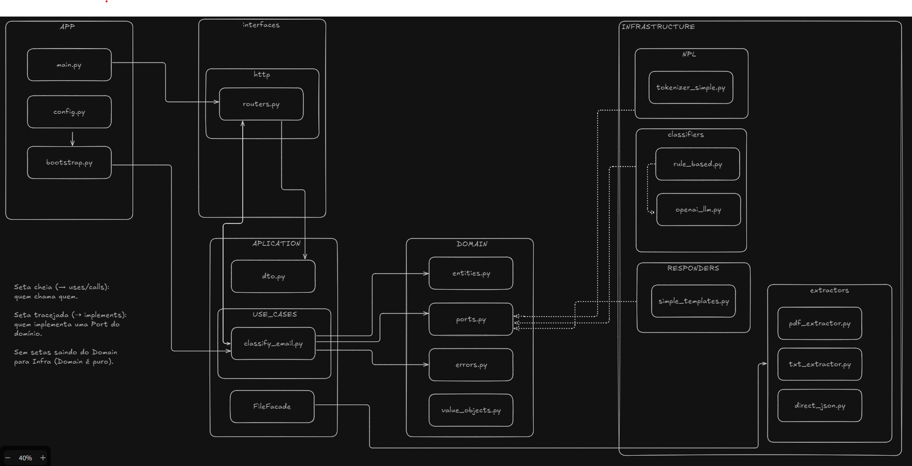
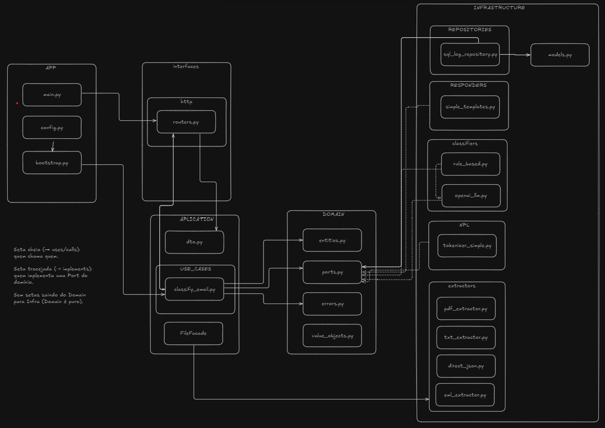
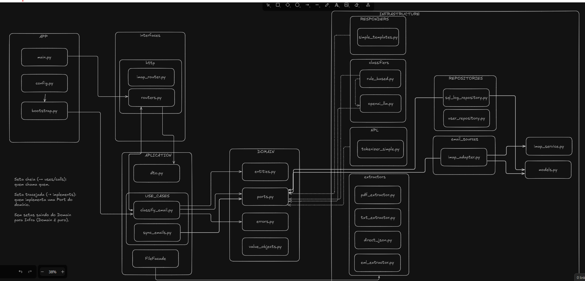

# 📧 Email Classifier — Backend (FastAPI + DDD-lite)

Lean MVP for **automatic email classification**.  
Receives **direct text**, **files (.pdf / .txt)** or reads directly from an **IMAP inbox**,  
classifies the email as **Productive** or **Unproductive** and generates a **suggested reply**.

**Hexagonal** architecture (ports & adapters), with independent **use cases** and replaceable adapters.  
By default uses **rule-based** classifier, but it's possible to plug in **LLMs** (e.g., OpenAI).

---

## ✨ Features

- `POST /classify`  
  Accepts **JSON** or **multipart** (`.pdf` / `.txt`)
- **File facade** (PDF/TXT → text)
- **Simple NLP**: lowercasing, stopwords, regex tokenization
- **Classification**:
  - 🎯 Rule-based (default, no cost)
  - 🤖 OpenAI LLM (optional via `OPENAI_API_KEY`)
- **Suggested reply** short and automatic
- **Logs** persisted in SQLite
- **IMAP Service**:
  - `POST /imap/config` → connects to inbox
  - `GET /imap/status` → service status
  - `POST /imap/stop` → terminates IMAP worker
  - Thread worker (`ImapService`) that periodically classifies new emails
- Swagger at `/docs`
- `GET /health` for monitoring

---

## 📚 Additional Documentation

Besides this README, the project has extra docs in the [`docs/`](./docs) folder:

- [📌 MVP.md](./docs/MVP.md) → description of initial scope and MVP objectives
- [⚙️ CICD.md](./docs/CICD.md) → notes on CI/CD pipeline
- [📬 BeforeImap.md](./docs/BeforeImap.md) → planning and decisions before IMAP service implementation
- [📑 logs.md](./docs/logs.md) → details about log storage and structure

---

---

## 🏗️ Evolutionary Architecture

The project went through different architecture stages.  
Here we record the diagrams and models that show how the system evolved.

### 1. 📐 Conceptual Model (Version 1)

First system modeling focused on **simple NLP** flow before AI integration.



---

### 2. 📐 Conceptual Model (Version 2 — Revised)

Model adjustment to **align NLP process** with **AI**, in the context of **user profiles** (considering relevance or not).



---

### 3. 🗂️ Initial Architecture

Lean architecture only with `POST /classify` route.



---

### 4. 📨 Architecture with IMAP

Evolution with addition of `POST /imap/config` route and **IMAP worker** service to periodically classify new emails.



---

### 5. 🗃️ Architecture with Logs + SQLite Repository

Current version: inclusion of `/logs` route and **SQLite repository**, centralizing results persistence.



---

## 🏗️ Architecture (Logical View)

**Flow via IMAP**

1. Frontend sends `host, user, app_password, mailbox, profile_id`
2. Backend starts a **worker (thread)** with `ImapService`
3. Worker calls `SyncEmailsUseCase.run()` periodically
4. Each email:
   - Tokenization → Classification
   - Log persisted in SQLite
   - Message moved to folder (`Productive` or `Unproductive`)

---

## 📁 Folder Structure

```bash
email_classifier/
app
├── application
│   ├── dto.py
│   └── use_cases
│       ├── classify_email.py
│       └── sync_emails.py
├── auth
│   └── jwt.py
├── bootstrap.py
├── config.py
├── data
│   └── profiles.json
├── domain
│   ├── entities.py
│   ├── errors.py
│   └── ports.py
├── infrastructure
│   ├── classifiers
│   │   ├── openai_llm.py
│   │   ├── rule_based.py
│   │   └── smart_classifier.py
│   ├── db.py
│   ├── email_sources
│   │   ├── imap_adapter.py
│   │   └── imap_service.py
│   ├── extractors
│   │   ├── direct_json.py
│   │   ├── eml_extractor.py
│   │   ├── pdf_extractor.py
│   │   └── txt_extractor.py
│   ├── models.py
│   ├── nlp
│   │   └── tokenizer_simple.py
│   ├── profiles
│   │   └── profile_json.py
│   ├── repositories
│   │   ├── sql_log_repository.py
│   │   └── user_repository.py
│   └── responders
│       └── simple_templates.py
├── interfaces
│   └── http
│       ├── imap_router.py
│       └── routers.py
├── main.py
└── ratelimiting.py

16 directories, 30 files
```

---

# ⚙️ Configuration and Backend Deploy

This document describes the necessary environment variables and the deployment process for the **Email Classifier** backend using **Docker**.

---

## 📌 Environment Variables (`.env`)

Variables control classifier and API behavior.

```env
# AI provider (currently: openai)
AI_PROVIDER=openai

# API key for AI provider
OPENAI_API_KEY=sk-xxxxxxxxxxxxxxxx

# Enable or disable AI usage (true = uses LLM, false = rules only)
USE_OPENAI=true

# Default OpenAI model
OPENAI_MODEL=gpt-4.1-mini

# Allowed origins (CORS)
ALLOW_ORIGINS=http://localhost:3000,http://127.0.0.1:3000

# Minimum confidence for rule-based classifier (0 to 1)
RB_MIN_CONF=0.70

# Maximum accepted email body characters
MAX_BODY_CHARS=8000
```

---

## 📦 Dependencies

- **fastapi / uvicorn** → Modern API
- **pydantic** → Validation
- **sqlalchemy + sqlmodel** → Persistence (SQLite)
- **imaplib** → IMAP integration
- **pypdf** → PDF parsing
- **python-multipart** → File upload
- **slowapi** → Rate limiting

---

## ▶️ How to Run (Local)

### 1. Backend

```bash
pip install -r requirements.txt
uvicorn app.main:app --reload
```

### 2. Frontend (Next.js)

```bash
cd email-classifier-frontend
pnpm dev
```

> Set `NEXT_PUBLIC_API_URL=http://localhost:8000`

---

## 🔌 Endpoints

### Health

`GET /health`

```json
{ "status": "ok" }
```

### Manual Classification

`POST /classify` → via JSON or upload (`.pdf/.txt`)

### Logs

`GET /logs` → SQLite history

### IMAP

- `POST /imap/config` → starts IMAP service
- `GET /imap/status` → current status
- `POST /imap/stop` → terminates service

---

## 🧪 Example — Start IMAP

```bash
curl -X POST http://127.0.0.1:8000/imap/config \
  -H "Content-Type: application/json" \
  -d '{
    "host": "imap.gmail.com",
    "user": "youremail@gmail.com",
    "password": "google_app_password",
    "mailbox": "INBOX",
    "profile_id": "default",
    "interval": 10
  }'
```

Response:

```json
{
  "status": "imap running",
  "profile_id": "default",
  "host": "imap.gmail.com",
  "mailbox": "INBOX",
  "interval": 10
}
```

---

## 📍 Future Roadmap

- Cost/latency metrics in each log
- Web dashboard to explore logs
- Multi-account IMAP support
- Stemming, lemmatization and multilingual
- Plug-and-play for other LLMs

---

## 📜 License

MIT — free use for prototypes and study.
